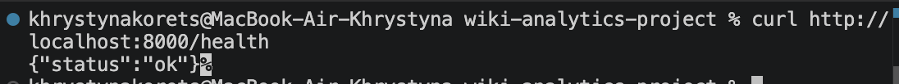
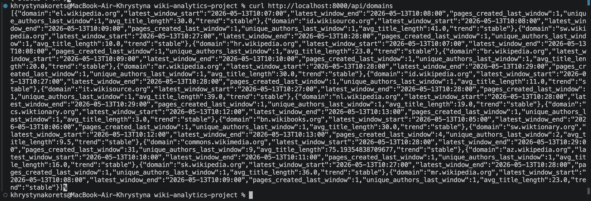
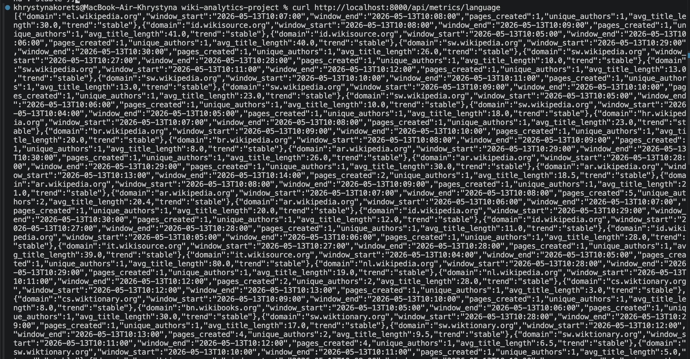
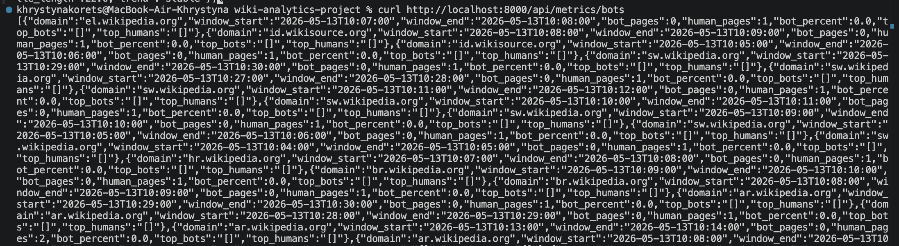
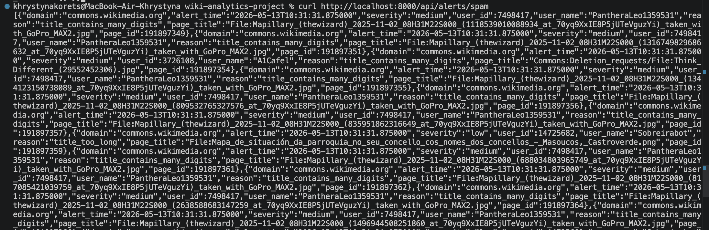
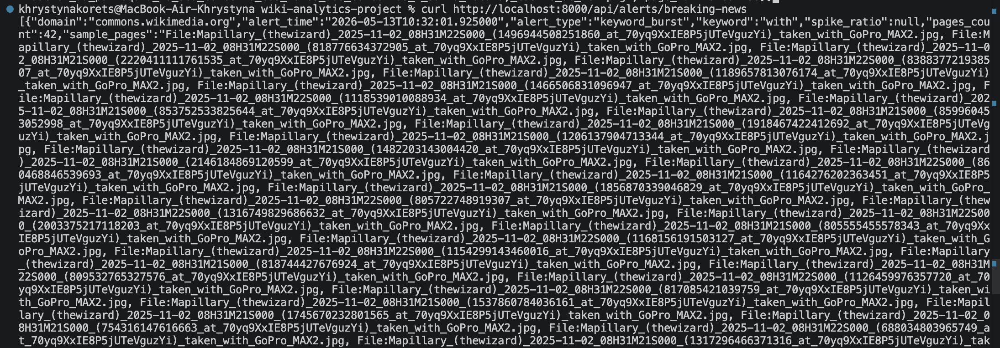
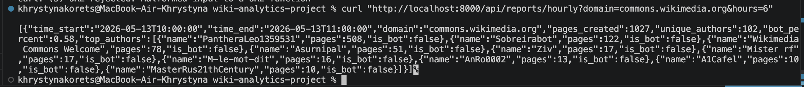
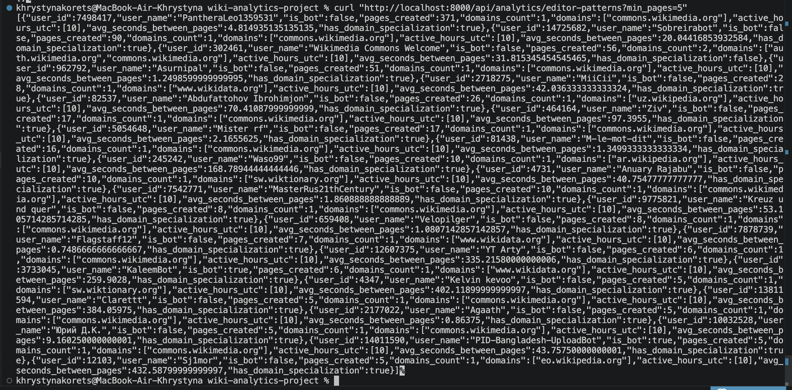

# Wikipedia Analytics Platform

## Опис проєкту

Wikipedia Analytics Platform — це аналітична платформа для обробки подій створення сторінок у Wikimedia в реальному часі.

Система читає live-події з Wikimedia EventStreams API, передає їх у Kafka, обробляє через Spark Structured Streaming, зберігає результати в Cassandra та надає доступ до аналітики через REST API і Streamlit Dashboard.

Проєкт реалізує:

- real-time ingestion з Wikimedia EventStreams;
- передачу подій через Kafka;
- streaming analytics через Spark Structured Streaming;
- збереження raw data, метрик та алертів у Cassandra;
- REST API на FastAPI;
- UI dashboard на Streamlit;
- breaking news alerts;
- bot vs human activity metrics;
- language/domain activity metrics;
- spam/vandalism alerts;
- ad-hoc API queries.

---

## Архітектура

```text
Wikimedia EventStreams API
        ↓
Python Ingestion Service
        ↓
Kafka topic: wiki-page-create
        ↓
Spark Structured Streaming
        ↓
Cassandra
        ↓
FastAPI REST API
        ↓
Streamlit Dashboard
```

---

## Технології

- Python
- Apache Kafka
- Apache Spark Structured Streaming
- Apache Cassandra
- FastAPI
- Streamlit
- Docker Compose

---

## Структура проєкту

```text
wiki-analytics-project/
│
├── docker-compose.yml
├── README.md
│
├── ingestion/
│   ├── Dockerfile
│   ├── requirements.txt
│   └── ingest_wikimedia.py
│
├── streaming/
│   └── wiki_streaming_job.py
│
├── api/
│   ├── Dockerfile
│   ├── requirements.txt
│   └── main.py
│
├── dashboard/
│   ├── Dockerfile
│   ├── requirements.txt
│   └── app.py
│
├── cassandra/
│   └── init.cql
│
└── scripts/
    └── create_topics.sh
```

---

## Основні компоненти

### 1. Ingestion Service

Сервіс читає події з Wikimedia EventStreams API:

```text
https://stream.wikimedia.org/v2/stream/page-create
```

Після цього нормалізує події та записує їх у Kafka topic:

```text
wiki-page-create
```

Приклад події:

```json
{
  "domain": "en.wikipedia.org",
  "page_id": 123456,
  "page_title": "Example page",
  "user_id": 1001,
  "user_name": "SomeUser",
  "is_bot": false,
  "created_at": "2026-05-10T19:15:00+00:00",
  "title_length": 12
}
```

---

### 2. Kafka

Kafka використовується як message broker між ingestion service та Spark Streaming.

Topics:

```text
wiki-page-create
breaking-news-alerts
bot-alerts
spam-alerts
```

Основний topic:

```text
wiki-page-create
```

---

### 3. Spark Structured Streaming

Spark читає live-події з Kafka та виконує real-time analytics.

Реалізовано:

#### Breaking News Detector

Виявляє keyword burst у назвах новостворених сторінок.

Наприклад, якщо одне слово часто зʼявляється у назвах сторінок протягом короткого часу, система створює alert.

Результати зберігаються в таблиці:

```text
breaking_news_alerts
```

#### Bot vs Human Activity Monitor

Рахує активність ботів та людей по кожному домену.

Метрики:

```text
bot_pages
human_pages
bot_percent
```

Результати зберігаються в таблиці:

```text
bot_activity_metrics
```

#### Language Activity Dashboard

Рахує активність по Wikimedia-доменах.

Метрики:

```text
pages_created
unique_authors
avg_title_length
trend
```

Результати зберігаються в таблиці:

```text
language_activity
```

#### Spam & Vandalism Detector

Виявляє підозрілі назви сторінок.

Перевіряються такі правила:

```text
назва містить URL
назва містить багато цифр
назва надто коротка
назва надто довга
```

Результати зберігаються в таблиці:

```text
spam_alerts
```

---

### 4. Cassandra

Cassandra використовується для збереження raw events, метрик та алертів.

Основні таблиці:

```text
raw_pages
pages_by_user
pages_by_id
language_activity
bot_activity_metrics
breaking_news_alerts
spam_alerts
```

---

### 5. FastAPI

FastAPI надає REST API для доступу до збережених даних.

Основні endpoints:

```text
GET /
GET /health
GET /api/domains
GET /api/pages/{page_id}
GET /api/users/{user_id}/pages
GET /api/domains/{domain}/pages
GET /api/metrics/language
GET /api/metrics/bots
GET /api/alerts/spam
GET /api/alerts/breaking-news
GET /api/reports/hourly
GET /api/analytics/editor-patterns
```

Swagger UI доступний за адресою:

```text
http://localhost:8000/docs
```

---

### 6. Streamlit Dashboard

Dashboard показує результати роботи системи у зручному UI.

Доступний за адресою:

```text
http://localhost:8501
```

Dashboard містить:

```text
Overview
Language Activity
Bot Activity
Breaking News
Spam Alerts
Search
```

---

## Як запустити проєкт

### Крок 1. Запустити інфраструктуру

У корені проєкту виконати:

```bash
docker compose up -d kafka cassandra spark-master spark-worker
```

Перевірити, що контейнери запущені:

```bash
docker ps
```

Мають бути контейнери:

```text
kafka
cassandra
spark-master
spark-worker
```

---

### Крок 2. Ініціалізувати Cassandra

Cassandra може запускатися 1–3 хвилини. Якщо одразу не підключається — треба трохи зачекати.

Запустити DDL-скрипт:

```bash
docker exec -it cassandra cqlsh -f /init.cql
```

Перевірити таблиці:

```bash
docker exec -it cassandra cqlsh
```

У `cqlsh` виконати:

```sql
USE wiki_analytics;
DESCRIBE TABLES;
```

Очікувані таблиці:

```text
raw_pages
pages_by_user
pages_by_id
language_activity
bot_activity_metrics
breaking_news_alerts
spam_alerts
```

Вийти з `cqlsh`:

```sql
exit;
```

---

### Крок 3. Створити Kafka topics

Запустити скрипт:

```bash
bash scripts/create_topics.sh
```

Якщо `bash` не працює на Windows, можна створити topics вручну:

```bash
docker exec -it kafka /opt/kafka/bin/kafka-topics.sh --bootstrap-server kafka:9092 --create --if-not-exists --topic wiki-page-create --partitions 3 --replication-factor 1

docker exec -it kafka /opt/kafka/bin/kafka-topics.sh --bootstrap-server kafka:9092 --create --if-not-exists --topic breaking-news-alerts --partitions 3 --replication-factor 1

docker exec -it kafka /opt/kafka/bin/kafka-topics.sh --bootstrap-server kafka:9092 --create --if-not-exists --topic bot-alerts --partitions 3 --replication-factor 1

docker exec -it kafka /opt/kafka/bin/kafka-topics.sh --bootstrap-server kafka:9092 --create --if-not-exists --topic spam-alerts --partitions 3 --replication-factor 1
```

Перевірити topics:

```bash
docker exec -it kafka /opt/kafka/bin/kafka-topics.sh --bootstrap-server kafka:9092 --list
```

Очікуваний результат:

```text
wiki-page-create
breaking-news-alerts
bot-alerts
spam-alerts
```

---

### Крок 4. Запустити ingestion service

```bash
docker compose up -d --build ingestion
```

Перевірити логи:

```bash
docker logs -f ingestion
```

Очікуваний результат:

```text
[INGESTION] Connected to Kafka
[INGESTION] Connecting to Wikimedia EventStreams...
[INGESTION] Wikimedia HTTP status: 200
[INGESTION] Sent page: domain=...
```

---

### Крок 5. Перевірити, що Kafka отримує події

```bash
docker exec -it kafka /opt/kafka/bin/kafka-console-consumer.sh --bootstrap-server kafka:9092 --topic wiki-page-create --from-beginning --max-messages 5
```

Очікуваний результат — JSON-події з Wikimedia:

```json
{
  "domain": "commons.wikimedia.org",
  "page_id": 191750976,
  "page_title": "File:Example.jpg",
  "user_id": 11128059,
  "user_name": "ExampleUser",
  "is_bot": false,
  "created_at": "2026-05-10T19:15:19.228+00:00",
  "title_length": 119
}
```

---

### Крок 6. Запустити Spark Streaming job

Перед запуском можна очистити checkpoints:

```bash
docker exec -it spark-master bash -c "rm -rf /tmp/checkpoints/wiki_raw_pages /tmp/checkpoints/wiki_language_activity /tmp/checkpoints/wiki_bot_activity /tmp/checkpoints/wiki_spam_alerts /tmp/checkpoints/wiki_breaking_news"
```

Запустити Spark job:

```bash
docker exec -it spark-master /opt/spark/bin/spark-submit --master spark://spark-master:7077 --conf spark.jars.ivy=/tmp/.ivy2 --packages org.apache.spark:spark-sql-kafka-0-10_2.12:3.5.1,com.datastax.spark:spark-cassandra-connector_2.12:3.5.1 /opt/spark/app/streaming/wiki_streaming_job.py
```

Очікуваний результат:

```text
[SPARK] Wikipedia streaming job started
[SPARK] Batch 1: raw pages written to Cassandra
[SPARK] Batch 1: language activity written to Cassandra
[SPARK] Batch 1: bot activity written to Cassandra
[SPARK] Batch 1: spam alerts written to Cassandra
[SPARK] Batch 1: breaking news alerts written to Cassandra
```

Якщо перший batch порожній — це нормально:

```text
[SPARK] Batch 0: no raw pages
```

Spark читає streaming-дані, тому треба трохи зачекати, поки прийдуть нові події.

---

### Крок 7. Запустити API

В іншому терміналі:

```bash
docker compose up -d --build api
```

Перевірити логи:

```bash
docker logs -f api
```

Очікуваний результат:

```text
[API] Connected to Cassandra
Uvicorn running on http://0.0.0.0:8000
```

Перевірити API:

```bash
curl http://localhost:8000/health
```

Або в PowerShell:

```powershell
Invoke-RestMethod http://localhost:8000/health
```

Очікувана відповідь:

```json
{
  "status": "ok"
}
```

Swagger UI:

```text
http://localhost:8000/docs
```

---

### Крок 8. Запустити Dashboard UI

```bash
docker compose up -d --build dashboard
```

Перевірити логи:

```bash
docker logs -f dashboard
```

Відкрити UI:

```text
http://localhost:8501
```

---

## Тестування API

### Health check

```powershell
Invoke-RestMethod http://localhost:8000/health
```



---

### Список доменів

```powershell
Invoke-RestMethod http://localhost:8000/api/domains
```



---

### Language activity metrics

```powershell
Invoke-RestMethod http://localhost:8000/api/metrics/language
```



---

### Bot activity metrics

```powershell
Invoke-RestMethod http://localhost:8000/api/metrics/bots
```



---

### Spam alerts

```powershell
Invoke-RestMethod http://localhost:8000/api/alerts/spam
```



---

### Breaking news alerts

```powershell
Invoke-RestMethod http://localhost:8000/api/alerts/breaking-news
```



---

### Hourly report

```powershell
Invoke-RestMethod "http://localhost:8000/api/reports/hourly?domain=en.wikipedia.org&hours=6"
```



---

### Editor patterns

```powershell
Invoke-RestMethod "http://localhost:8000/api/analytics/editor-patterns?min_pages=5"
```



---

## Корисні команди

### Перевірити контейнери

```bash
docker ps
```

---

### Перевірити Kafka topics

```bash
docker exec -it kafka /opt/kafka/bin/kafka-topics.sh --bootstrap-server kafka:9092 --list
```

---

### Подивитися повідомлення в Kafka

```bash
docker exec -it kafka /opt/kafka/bin/kafka-console-consumer.sh --bootstrap-server kafka:9092 --topic wiki-page-create --from-beginning --max-messages 5
```

---

### Відкрити Cassandra shell

```bash
docker exec -it cassandra cqlsh
```

---

### Подивитися таблиці Cassandra

```sql
USE wiki_analytics;
DESCRIBE TABLES;
```

---

### Подивитися raw pages

```sql
SELECT domain, created_at, page_id, page_title, user_name, is_bot
FROM raw_pages
LIMIT 10;
```

---

### Подивитися language activity

```sql
SELECT domain, window_start, pages_created, unique_authors, avg_title_length
FROM language_activity
LIMIT 10;
```

---

### Подивитися bot activity

```sql
SELECT domain, window_start, bot_pages, human_pages, bot_percent
FROM bot_activity_metrics
LIMIT 10;
```

---

### Подивитися breaking news alerts

```sql
SELECT domain, alert_time, alert_type, keyword, pages_count
FROM breaking_news_alerts
LIMIT 10;
```

---

### Подивитися spam alerts

```sql
SELECT domain, alert_time, severity, reason, page_title
FROM spam_alerts
LIMIT 10;
```

---

## UI Dashboard

Dashboard доступний за адресою:

```text
http://localhost:8501
```

У ньому є такі сторінки:

### Overview

Загальний огляд системи:

- кількість доменів;
- кількість сторінок у metric windows;
- кількість breaking news alerts;
- кількість spam alerts.

### Language Activity

Показує активність по доменах:

- domain;
- window_start;
- pages_created;
- unique_authors;
- avg_title_length.

Також показує графіки активності.

### Bot Activity

Показує співвідношення bot/human activity:

- bot_pages;
- human_pages;
- bot_percent.

### Breaking News

Показує keyword burst alerts.

### Spam Alerts

Показує spam/vandalism alerts.

### Search

Дозволяє виконувати ad-hoc queries:

- пошук сторінки за page_id;
- пошук сторінок користувача за user_id;
- пошук сторінок за domain;
- hourly report;
- editor patterns.

---

## Що здавати

Для здачі проєкту варто додати:

```text
README.md
DESIGN.md
docker-compose.yml
cassandra/init.cql
ingestion/
streaming/
api/
dashboard/
scripts/
results/
```

У папку `results/` можна покласти скріншоти або JSON-відповіді.

Рекомендовані результати:

```text
docker_ps.png
kafka_messages.png
spark_logs.png
cassandra_tables.png
api_docs.png
api_domains.json
api_language_metrics.json
api_bot_metrics.json
api_spam_alerts.json
api_breaking_news_alerts.json
api_hourly_report.json
api_editor_patterns.json
dashboard_overview.png
dashboard_alerts.png
```

---

## Як зберегти API responses у JSON

Створити папку:

```powershell
mkdir results
```

Зберегти результати:

```powershell
Invoke-RestMethod http://localhost:8000/api/domains | ConvertTo-Json -Depth 10 > results/api_domains.json

Invoke-RestMethod http://localhost:8000/api/metrics/language | ConvertTo-Json -Depth 10 > results/api_language_metrics.json

Invoke-RestMethod http://localhost:8000/api/metrics/bots | ConvertTo-Json -Depth 10 > results/api_bot_metrics.json

Invoke-RestMethod http://localhost:8000/api/alerts/spam | ConvertTo-Json -Depth 10 > results/api_spam_alerts.json

Invoke-RestMethod http://localhost:8000/api/alerts/breaking-news | ConvertTo-Json -Depth 10 > results/api_breaking_news_alerts.json
```

---

## Зупинка проєкту

Зупинити всі контейнери:

```bash
docker compose down
```

Зупинити та видалити volumes, якщо треба повністю очистити Cassandra data:

```bash
docker compose down -v
```

---

## Примітки

- Cassandra може стартувати довше за інші сервіси, тому перед запуском `cqlsh` треба почекати.
- Spark job працює у streaming mode, тому його треба залишити запущеним, щоб він продовжував обробляти нові події.
- Якщо Spark job перезапускається після змін у коді, бажано очищати checkpoints.
- Для демонстрації breaking news alerts можна тимчасово зменшити threshold keyword burst, щоб швидше отримати алерти.